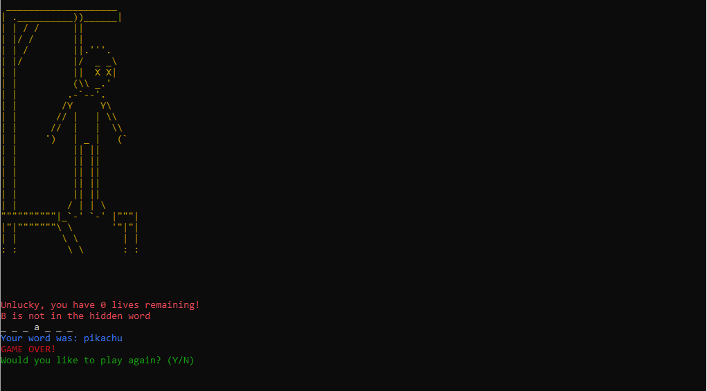
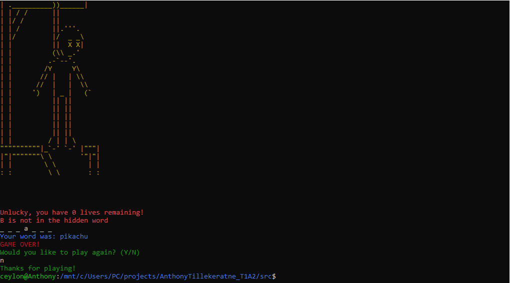
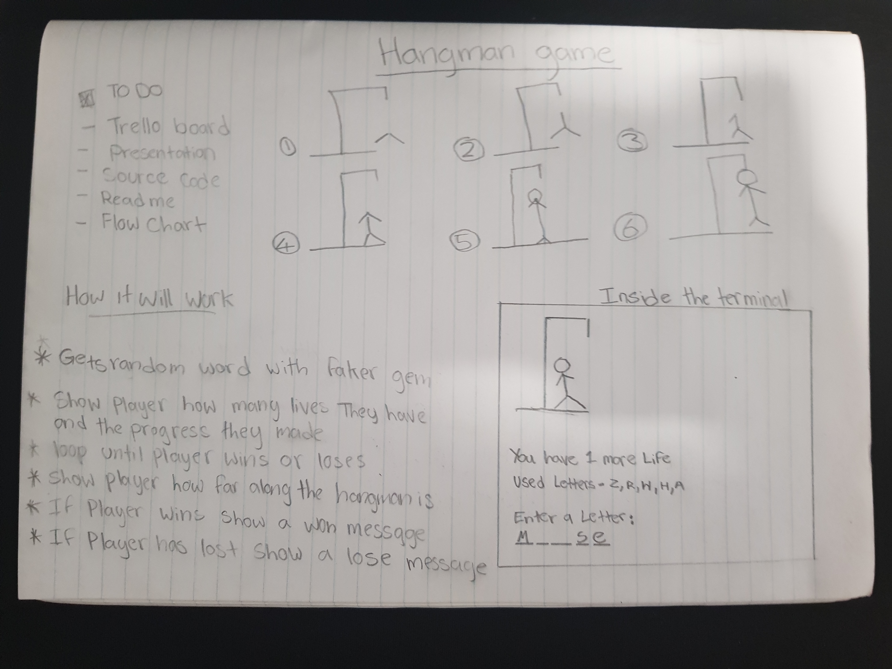
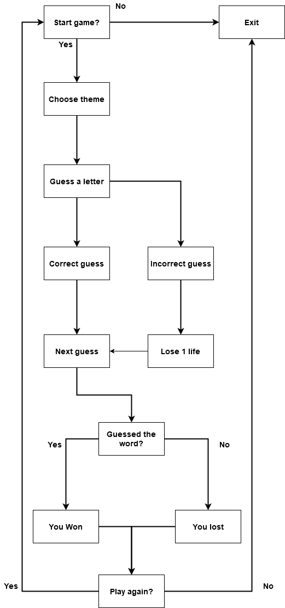

# **Hangman**

## By Anthony Tillekeratne

[GitHub Repository](https://github.com/Anthonytilleke/Hangman_terminal_app)

---

## Description

Hangman is a quick and simple terminal game created with ruby, meant to be played in a command-line interface. 

---

## Functionality & Screenshots

Upon opening the application, the user is prompted with the home screen for Hangman. From there they are presented with a little welcome message to the player, instructions on now to play the game, how to exit the game and a choice to start the game.

Once the player has selected the "Start game" option they will be prompted to this screen, where they can choose the theme of the word they have to try and uncover.

 

Once the player has selected a theme of their choice, they will be shown this. The player will now start to try and guess the letters in the hidden word.

 

The player will be shown this screen if they guess a letter incorrectly. They get 6 lives at the start of the game, The ASCII art will progress along with how many lives the player has.

 

Once the player has correctly guessed a letter, it will show up in one of the blank spaces below.

 

Player progress along with the ASCII art.

Once te player has completed the game without losing all their lives, they will be prompted to this screen. It will tell the player they have won the round, it will also show the word the player was trying to guess and it will give the player two options, play again or exit the application.

However, if the player isnt able to find out what the word is before all their lives are up, they will be shown this screen. It will tell the player that the game has ended, along with the word and a option to play again.

If the player decides to not play anymore a message will be shows saying "Thanks for playing!"

If the player chooses to play the game once more they will be brought back to the welcome screen.

---

## Instructions for installation and use

1. Fork or clone this repository down to your local computer
2. Use the command-line and navigate to `/AnthonyTillekeratne_T1A2/src/`. Once your in the src directory type in `bundle install` in your command-line and press Enter to install
3. After you have entered in bundle install in your command-line, in the same directory typle in `ruby main.rb` to run the application

--- 

## Design & Planning Process

---

## Trello

